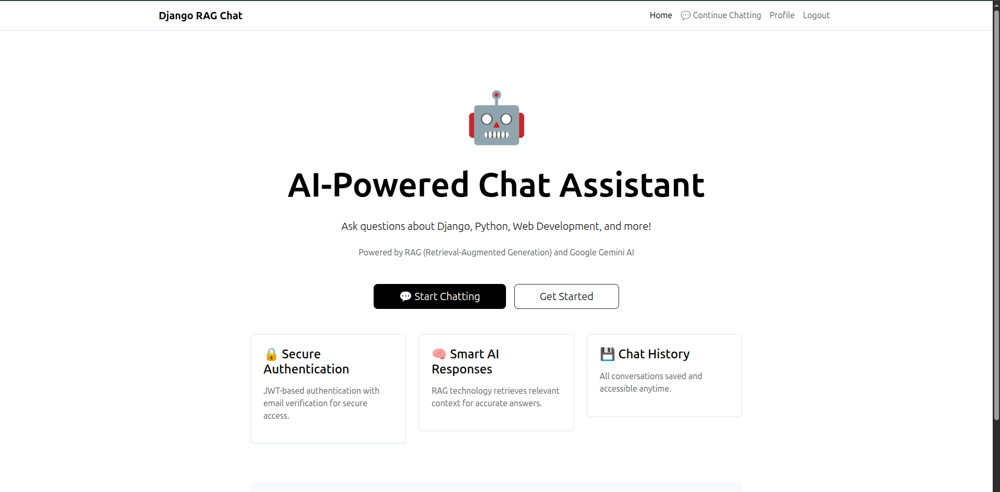
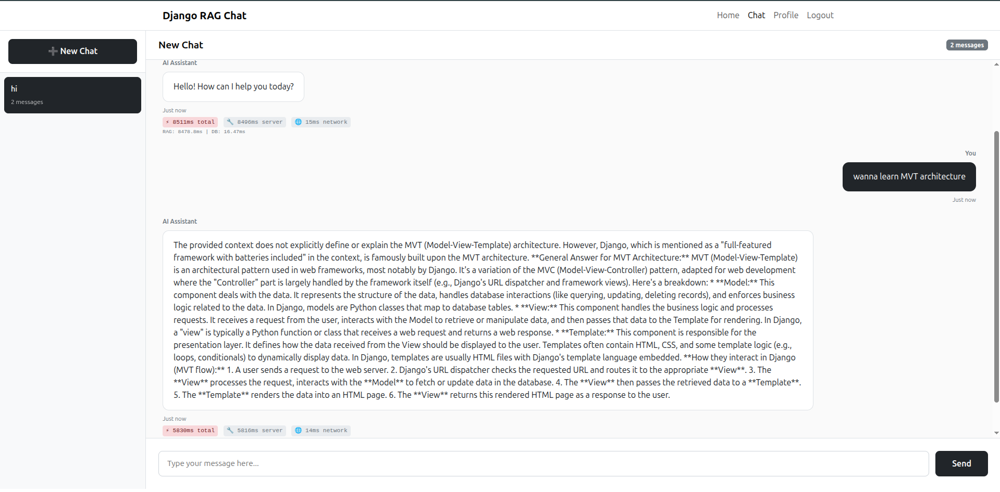
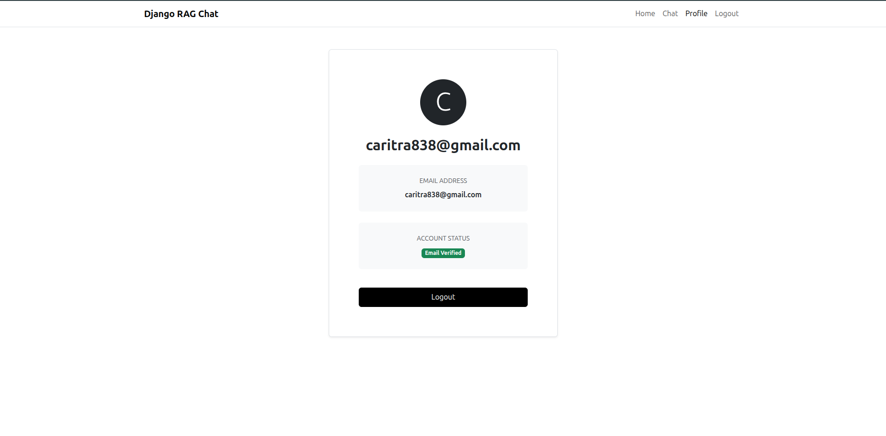

# Django RAG Chat Application

A production-ready, full-stack AI chatbot application featuring secure JWT authentication, RAG (Retrieval-Augmented Generation) using FAISS and Google Gemini, multi-conversation management, email verification, and automated background task scheduling.

---

## 📸 Screenshots

### Landing Page

*Clean and modern landing page with quick access to chat functionality*

### Chat Interface

*Multi-conversation management with real-time AI responses and latency tracking*

### User Profile

*User profile with account information and authentication management*


## 📋 Table of Contents

- [Project Overview](#-project-overview)
- [Features](#-features)
- [Technologies Used](#-technologies-used)
- [Project Architecture](#-project-architecture)
- [Setup Instructions](#-setup-instructions)
- [API Documentation](#-api-documentation)
- [Background Task Setup](#-background-task-setup)
- [Usage Guide](#-usage-guide)
- [Project Structure](#-project-structure)
- [Development](#-development)
- [Security](#-security)
- [Troubleshooting](#-troubleshooting)
- [License](#-license)

---

## 🎯 Project Overview

This Django-based application is a sophisticated AI-powered chat system that combines modern web development practices with advanced machine learning capabilities. It demonstrates:

- **Secure Authentication**: JWT-based authentication with email verification using asynchronous SMTP
- **Intelligent Responses**: RAG-powered AI using FAISS vector search and Google Gemini LLM
- **Multi-Chat Management**: Organize conversations with create, rename, and delete functionality
- **Background Processing**: Automated housekeeping tasks using APScheduler
- **Modern UI/UX**: Bootstrap 5 minimal white theme with responsive design
- **Production-Ready**: Security best practices, error handling, and scalable architecture

### How It Works

1. **User Registration**: Users sign up with email verification sent asynchronously (non-blocking)
2. **Authentication**: JWT tokens provide secure, stateless authentication
3. **Chat Interface**: Users create multiple conversation threads
4. **AI Responses**: 
   - User query is embedded using SentenceTransformers
   - FAISS searches the knowledge base for relevant context
   - Google Gemini generates contextual responses
   - Response latency is tracked and displayed
5. **Background Tasks**: APScheduler automatically cleans old data and maintains system health

---

## ✨ Features

### 🔐 Authentication & Security
- ✅ User registration with email verification (asynchronous SMTP)
- ✅ JWT token-based authentication (access + refresh tokens)
- ✅ Email verification required before login
- ✅ Secure password hashing (PBKDF2)
- ✅ User profile management
- ✅ Protected API endpoints

### 🤖 AI Chat System
- ✅ **RAG (Retrieval-Augmented Generation)**: Contextual AI responses from custom knowledge base
- ✅ **FAISS Vector Search**: Fast semantic similarity search for relevant context retrieval
- ✅ **Google Gemini LLM**: State-of-the-art language model for natural conversations
- ✅ **Multi-Conversation Support**: Create unlimited conversation threads
- ✅ **Conversation Management**: Rename, delete, and organize chats
- ✅ **Persistent History**: All messages saved with timestamps
- ✅ **Response Latency Tracking**: Real-time performance monitoring

### ⏰ Background Task Scheduler
- ✅ **Automated Cleanup**: Delete conversations older than 30 days
- ✅ **Data Integrity**: Remove orphaned messages and maintain database health
- ✅ **User Management**: Clean up unverified users after 7 days
- ✅ **Statistics Generation**: Track system usage and health metrics
- ✅ **Web Dashboard**: Admin interface for monitoring and manual task triggers
- ✅ **Scheduled Jobs**: Daily, weekly, and interval-based tasks

### 🎨 User Interface
- ✅ Bootstrap 5 minimal white mode design
- ✅ Responsive navbar with authentication state
- ✅ Multi-chat sidebar with conversation list
- ✅ Real-time message display with typing indicators
- ✅ Profile page with user information
- ✅ Landing page with quick actions
- ✅ Mobile-friendly responsive design

---

## 🔧 Technologies Used

### Backend Framework
- **Django 4.2+**: High-level Python web framework
- **Django REST Framework**: Powerful API toolkit
- **djangorestframework-simplejwt**: JWT authentication
- **python-dotenv**: Environment variable management

### AI & Machine Learning
- **Google Generative AI (Gemini)**: Advanced LLM for response generation
- **SentenceTransformers**: State-of-the-art embedding model (`all-MiniLM-L6-v2`)
- **FAISS (Facebook AI Similarity Search)**: Efficient vector similarity search
- **NumPy**: Numerical computing for embeddings

### Task Scheduling
- **APScheduler**: Advanced Python scheduler for background tasks
- **Threading**: Asynchronous email sending

### Frontend
- **Bootstrap 5**: Modern CSS framework
- **Vanilla JavaScript**: No framework overhead
- **Responsive Design**: Mobile-first approach

### Email Service
- **Gmail SMTP**: Production-ready email delivery
- **TLS Security**: Encrypted email transmission
- **Asynchronous Threading**: Non-blocking email sending

### Database
- **SQLite**: Development database (default)
- **PostgreSQL**: Recommended for production
- **Django ORM**: Database abstraction layer

---

## 🏗️ Project Architecture

### System Design

```
┌─────────────────┐
│   Frontend      │ Bootstrap 5 + Vanilla JS
│   (HTML/CSS/JS) │
└────────┬────────┘
         │ HTTP/HTTPS + JWT
         ▼
┌─────────────────────────────────────────┐
│        Django REST Framework            │
│  ┌──────────────┐  ┌─────────────────┐ │
│  │ Authentication│  │   Chat API      │ │
│  │  - Signup    │  │  - Send Message │ │
│  │  - Login     │  │  - Conversations│ │
│  │  - Profile   │  │  - Delete/Rename│ │
│  └──────┬───────┘  └────────┬────────┘ │
└─────────┼───────────────────┼──────────┘
          │                   │
          ▼                   ▼
┌──────────────────┐   ┌──────────────────┐
│   Email Service  │   │   RAG Service    │
│  - SMTP Thread   │   │ ┌──────────────┐ │
│  - Verification  │   │ │SentenceTransf│ │
│  - Async Send    │   │ │   ormer      │ │
└──────────────────┘   │ └──────┬───────┘ │
                        │        ▼         │
                        │ ┌──────────────┐ │
┌──────────────────┐   │ │ FAISS Index  │ │
│   APScheduler    │   │ │Vector Search │ │
│  - Daily Tasks   │   │ └──────┬───────┘ │
│  - Weekly Cleanup│   │        ▼         │
│  - Statistics    │   │ ┌──────────────┐ │
└──────────────────┘   │ │Google Gemini │ │
                        │ │    LLM       │ │
                        │ └──────────────┘ │
                        └──────────────────┘
                                 │
                                 ▼
                        ┌──────────────────┐
                        │   Database       │
                        │  - Users         │
                        │  - Conversations │
                        │  - Messages      │
                        │  - Tokens        │
                        └──────────────────┘
```

### Data Models

**User** (Django built-in)
- username, email, password (hashed)
- is_active, is_verified

**EmailVerification**
- user (FK), token, created_at

**Conversation**
- user (FK), title, created_at, updated_at

**ChatMessage**
- conversation (FK), user_message, ai_response, timestamp

---

## 🚀 Setup Instructions

### Prerequisites

- **Python 3.8 or higher**
- **pip** (Python package manager)
- **Gmail account** (for SMTP email service)
- **Google AI API Key** (for Gemini)
- **Git** (for version control)

### Step 1: Clone the Repository

```bash
git clone <repository-url>
cd Python-RAG-Appliaction
```

### Step 2: Create Virtual Environment

```bash
# Create virtual environment
python3 -m venv venv

# Activate virtual environment
# On Linux/Mac:
source venv/bin/activate

# On Windows:
venv\Scripts\activate
```

### Step 3: Install Dependencies

```bash
pip install -r requirements.txt
```

**Dependencies include:**
- Django>=4.2.0
- djangorestframework>=3.14.0
- djangorestframework-simplejwt>=5.3.0
- python-dotenv>=1.0.0
- sentence-transformers>=2.2.2
- faiss-cpu>=1.7.4
- google-generativeai>=0.3.0
- numpy>=1.24.0
- apscheduler>=3.10.0

### Step 4: Configure Environment Variables

Create a `.env` file in the project root:

```bash
cp .env.example .env
```

Edit `.env` with your credentials:

```env
# Django Configuration
SECRET_KEY=your-django-secret-key-here
DEBUG=True

# Email Configuration (Gmail SMTP)
EMAIL_HOST_USER=your-email@gmail.com
EMAIL_HOST_PASSWORD=your-16-char-app-password

# Google Gemini API
GEMINI_API_KEY=your-gemini-api-key-here
```

#### How to Get Gmail App Password:

1. Enable 2-Factor Authentication on your Google Account
2. Visit: https://myaccount.google.com/security
3. Navigate: **Security** → **2-Step Verification** → **App passwords**
4. Generate an app password for "Mail"
5. Copy the 16-character password to `.env` as `EMAIL_HOST_PASSWORD`

#### How to Get Gemini API Key:

1. Visit: https://makersuite.google.com/app/apikey
2. Sign in with your Google account
3. Click "Create API Key"
4. Copy the key to `.env` as `GEMINI_API_KEY`

### Step 5: Initialize Database

```bash
# Run migrations to create database tables
python manage.py migrate

# Create an admin user (optional but recommended)
python manage.py createsuperuser
```

Follow the prompts to create your admin account.

### Step 6: Customize Knowledge Base

Edit `knowledge_base.txt` to add your domain-specific information:

```bash
nano knowledge_base.txt
# or
vim knowledge_base.txt
```

The RAG system uses this file to provide contextual AI responses.

### Step 7: Run the Development Server

```bash
python manage.py runserver
```

The application will be available at: **http://127.0.0.1:8000**

### Step 8: Access the Application

- **Home Page**: http://127.0.0.1:8000/
- **Signup**: http://127.0.0.1:8000/api/auth/signup
- **Login**: http://127.0.0.1:8000/api/auth/login
- **Chat**: http://127.0.0.1:8000/chat-page
- **Admin Dashboard**: http://127.0.0.1:8000/admin (Django admin)
- **Scheduler Admin**: http://127.0.0.1:8000/scheduler-admin (superuser only)

---

## 📚 API Documentation

Complete API reference with request/response formats. See **[API.md](API.md)** for detailed documentation.

### Quick Reference

#### Authentication Endpoints

| Method | Endpoint | Description | Auth Required |
|--------|----------|-------------|---------------|
| POST | `/api/auth/signup` | Register new user | No |
| POST | `/api/auth/login` | Login and get JWT tokens | No |
| GET | `/api/auth/profile` | Get user profile | Yes (JWT) |
| GET | `/api/auth/verify-email/<token>` | Verify email address | No |

#### Chat Endpoints

| Method | Endpoint | Description | Auth Required |
|--------|----------|-------------|---------------|
| POST | `/api/chat` | Send message & get AI response | Yes (JWT) |
| GET | `/api/conversations` | List all conversations | Yes (JWT) |
| GET | `/api/conversations/<id>` | Get conversation with messages | Yes (JWT) |
| PUT | `/api/conversations/<id>/rename` | Rename conversation | Yes (JWT) |
| DELETE | `/api/conversations/<id>/delete` | Delete conversation | Yes (JWT) |

#### Admin Endpoints (Superuser Only)

| Method | Endpoint | Description | Auth Required |
|--------|----------|-------------|---------------|
| GET | `/api/admin/scheduler/status` | Get scheduler status | Yes (Superuser) |
| POST | `/api/admin/scheduler/trigger` | Trigger manual task | Yes (Superuser) |
| GET | `/api/admin/scheduler/statistics` | Get system statistics | Yes (Superuser) |

### Example API Calls

#### Signup
```bash
curl -X POST http://127.0.0.1:8000/api/auth/signup \
  -H "Content-Type: application/json" \
  -d '{
    "username": "johndoe",
    "email": "john@example.com",
    "password": "securepass123"
  }'
```

#### Login
```bash
curl -X POST http://127.0.0.1:8000/api/auth/login \
  -H "Content-Type: application/json" \
  -d '{
    "username": "johndoe",
    "password": "securepass123"
  }'
```

#### Send Chat Message
```bash
curl -X POST http://127.0.0.1:8000/api/chat \
  -H "Content-Type: application/json" \
  -H "Authorization: Bearer YOUR_ACCESS_TOKEN" \
  -d '{
    "message": "What is Django?",
    "conversation_id": 1
  }'
```

**For complete API documentation with all request/response formats, see [API.md](API.md)**

---

## ⏰ Background Task Setup

### Overview

The application uses **APScheduler** to run automated background tasks for system maintenance and data cleanup.

### Scheduled Tasks

| Task | Schedule | Description |
|------|----------|-------------|
| **Daily Housekeeping** | Every day at 2:00 AM | Runs all cleanup tasks |
| **Weekly Cleanup** | Every Sunday at 3:00 AM | Deletes old conversations (30+ days) |
| **Statistics Generation** | Every 6 hours | Generates system usage statistics |

### Task Details

#### 1. Delete Old Conversations
- **Function**: `delete_old_conversations()`
- **Action**: Removes conversations older than 30 days
- **Impact**: Cascades to delete all associated messages
- **Logging**: Logs the number of conversations deleted

#### 2. Cleanup Orphaned Messages
- **Function**: `cleanup_orphaned_messages()`
- **Action**: Removes messages without parent conversations
- **Purpose**: Maintains data integrity
- **Benefit**: Prevents database bloat

#### 3. Cleanup Inactive Users
- **Function**: `cleanup_inactive_users()`
- **Action**: Removes unverified users after 7 days
- **Purpose**: Prevent spam registrations
- **Benefit**: Cleans up incomplete signups

#### 4. Generate Statistics
- **Function**: `generate_statistics()`
- **Metrics**: Total users, active users, conversations, messages
- **Purpose**: System health monitoring
- **Frequency**: Every 6 hours

### Manual Task Execution

#### View Scheduler Status
```bash
python manage.py scheduler_info
```

This displays:
- Scheduler running status
- List of scheduled jobs
- Next run times for each job

#### Run All Housekeeping Tasks
```bash
python manage.py run_housekeeping
```

#### Run Specific Task
```bash
# Delete old conversations
python manage.py run_housekeeping --task conversations

# Clean orphaned messages
python manage.py run_housekeeping --task messages

# Remove inactive users
python manage.py run_housekeeping --task users

# Generate statistics
python manage.py run_housekeeping --task stats
```

### Web-Based Admin Dashboard

Access the scheduler admin dashboard at:
```
http://127.0.0.1:8000/scheduler-admin
```

**Requirements**: Must be logged in as superuser

**Features**:
- ✅ View real-time system statistics
- ✅ See scheduled jobs with next run times
- ✅ Trigger tasks manually with one click
- ✅ Auto-refresh every 30 seconds
- ✅ Visual feedback for task execution

**Statistics Displayed**:
- Total users
- Active users (last 30 days)
- Total conversations
- Total messages
- Average messages per conversation
- Overall database size

### How Background Tasks Work

1. **Initialization**: APScheduler starts when Django app initializes
2. **Background Thread**: Tasks run in separate thread (non-blocking)
3. **Persistence**: Scheduler continues across requests
4. **Error Handling**: Failed tasks are logged; don't crash server
5. **Manual Triggers**: Can be executed via command line or web dashboard

### Production Considerations

For production deployment:
- Use **persistent job stores** (database-backed)
- Configure **proper logging** (Sentry, CloudWatch)
- Set up **monitoring alerts** for failed tasks
- Consider **Celery** for more complex task queues
- Use **cron jobs** as backup for critical tasks

---

## 📖 Usage Guide

### For End Users

#### 1. Sign Up
1. Navigate to **Signup** page
2. Enter username, email, and password
3. Click "Sign Up"
4. Check your email for verification link
5. Click the link to verify your account

#### 2. Login
1. Go to **Login** page
2. Enter verified credentials
3. Receive JWT tokens (stored automatically)
4. Redirected to landing page

#### 3. Start Chatting
1. Click "Django RAG Chat" in navbar
2. Click "+ New Chat" to create conversation
3. Type your message and press Send
4. View AI response with latency info
5. Continue conversation in same thread

#### 4. Manage Conversations
- **Rename**: Click edit icon → enter new title
- **Delete**: Click trash icon → confirm deletion
- **Switch**: Click conversation in sidebar
- **View History**: All messages preserved

#### 5. View Profile
1. Click "Profile" in navbar
2. View your username and email
3. Check verification status
4. Logout when finished

### For Administrators

#### Access Django Admin
```
http://127.0.0.1:8000/admin
```
- Manage users, conversations, messages
- View email verification tokens
- Database administration

#### Access Scheduler Dashboard
```
http://127.0.0.1:8000/scheduler-admin
```
- Monitor system statistics
- View scheduled jobs
- Trigger manual cleanups

#### Monitor System
```bash
# Check logs
tail -f nohup.out

# View scheduler status
python manage.py scheduler_info

# Database shell
python manage.py dbshell
```

---

## 📂 Project Structure

```
Python-RAG-Appliaction/
│
├── core/                           # Django project settings
│   ├── settings.py                 # Main configuration
│   ├── urls.py                     # Root URL routing
│   └── wsgi.py                     # WSGI entry point
│
├── authentication/                 # Authentication app
│   ├── models.py                   # EmailVerification model
│   ├── views.py                    # Signup, login, profile views
│   ├── serializers.py              # User serializers
│   ├── emails.py                   # Async email service
│   ├── urls.py                     # Auth URL patterns
│   └── templates/
│       └── authentication/         # Auth HTML templates
│           ├── signup.html
│           ├── login.html
│           ├── profile.html
│           └── landing.html
│
├── chat/                           # Chat & RAG app
│   ├── models.py                   # Conversation & ChatMessage models
│   ├── views.py                    # Chat API endpoints
│   ├── serializers.py              # Chat serializers
│   ├── rag_service.py              # RAG + FAISS logic
│   ├── tasks.py                    # Background task definitions
│   ├── scheduler.py                # APScheduler configuration
│   ├── urls.py                     # Chat URL patterns
│   ├── management/
│   │   └── commands/
│   │       ├── run_housekeeping.py    # Manual task execution
│   │       └── scheduler_info.py      # Scheduler status command
│   └── templates/
│       └── chat/
│           ├── chat_multi.html        # Multi-chat interface
│           └── scheduler_admin.html   # Admin dashboard
│
├── manage.py                       # Django management script
├── requirements.txt                # Python dependencies
├── knowledge_base.txt              # RAG knowledge base
├── .env                            # Environment variables (DO NOT COMMIT)
├── .env.example                    # Environment template
├── .gitignore                      # Git ignore rules
├── db.sqlite3                      # SQLite database (development)
│
└── Documentation/
    ├── README.md                   # This file (comprehensive guide)
    ├── API.md                      # Complete API reference
    └── DEVELOPMENT.md              # Developer guidelines
```

---

## 💻 Development

### Development Workflow

See **[DEVELOPMENT.md](DEVELOPMENT.md)** for complete guidelines.

#### Quick Start for Developers

1. **Set up environment** (see Setup Instructions above)
2. **Create feature branch**:
   ```bash
   git checkout -b feature/your-feature
   ```
3. **Make changes** following code style guidelines
4. **Test thoroughly** with manual and automated tests
5. **Commit and push**:
   ```bash
   git add .
   git commit -m "Add feature: description"
   git push origin feature/your-feature
   ```

#### Useful Development Commands

```bash
# Django shell (test models, queries)
python manage.py shell

# Create new app
python manage.py startapp app_name

# Make migrations
python manage.py makemigrations
python manage.py migrate

# Collect static files
python manage.py collectstatic

# Run tests (when implemented)
python manage.py test

# Database shell
python manage.py dbshell
```

#### Code Style Guidelines

- **Python**: Follow PEP 8 (4 spaces, snake_case, max 79 chars)
- **JavaScript**: Use camelCase, const/let, ES6+ syntax
- **HTML/CSS**: Semantic HTML5, Bootstrap classes, minimal custom CSS
- **Docstrings**: Add for all functions and classes
- **Comments**: Only when necessary for clarity

---

## 🛡️ Security

### Implemented Security Measures

#### 1. Password Security
- ✅ **Hashing**: PBKDF2 with SHA256 (Django default)
- ✅ **No Plain Text**: Passwords never stored in plain text
- ✅ **Validation**: Enforce password requirements

#### 2. JWT Authentication
- ✅ **Stateless**: No server-side session storage
- ✅ **Token Expiry**: Access tokens expire after 60 minutes
- ✅ **Refresh Tokens**: 1-day lifetime, can renew access
- ✅ **Bearer Authentication**: Standard HTTP Authorization header

#### 3. Email Security
- ✅ **Environment Variables**: Credentials in `.env` (not code)
- ✅ **Git Ignore**: `.env` excluded from version control
- ✅ **App Passwords**: Use Gmail app-specific passwords
- ✅ **TLS Encryption**: Emails sent over encrypted connection

#### 4. API Security
- ✅ **Authentication Required**: Protected endpoints check JWT
- ✅ **User Isolation**: Users only access their own data
- ✅ **Input Validation**: All inputs validated by serializers
- ✅ **CSRF Protection**: Django CSRF middleware enabled

#### 5. Data Privacy
- ✅ **Email Verification**: Required before account activation
- ✅ **Unique Tokens**: One-time use verification tokens
- ✅ **Database Isolation**: ForeignKey constraints enforce ownership

### Security Best Practices

**For Production:**
- Set `DEBUG = False` in settings.py
- Use strong `SECRET_KEY` (generate new one)
- Configure `ALLOWED_HOSTS` properly
- Enable HTTPS (Let's Encrypt recommended)
- Use environment variables for all secrets
- Implement rate limiting (django-ratelimit)
- Set up WAF (Web Application Firewall)
- Regular security audits and updates

---

## 🔍 Troubleshooting

### Common Issues and Solutions

#### Issue: `ModuleNotFoundError: No module named 'X'`

**Solution**:
```bash
# Ensure virtual environment is activated
source venv/bin/activate  # Linux/Mac
venv\Scripts\activate     # Windows

# Reinstall dependencies
pip install -r requirements.txt
```

#### Issue: Emails not sending

**Solutions**:
1. Check `.env` has correct Gmail credentials
2. Verify you're using **App Password**, not regular password
3. Ensure 2FA is enabled on Google account
4. Check terminal logs for SMTP errors:
   ```
   SMTPAuthenticationError: Username and Password not accepted
   ```
5. Test SMTP connection:
   ```bash
   python manage.py shell
   from django.core.mail import send_mail
   send_mail('Test', 'Body', 'from@example.com', ['to@example.com'])
   ```

#### Issue: RAG responses are generic or irrelevant

**Solutions**:
1. Add more content to `knowledge_base.txt`
2. Restart server to reload knowledge base:
   ```bash
   # Stop server (Ctrl+C)
   python manage.py runserver
   ```
3. Check Gemini API key is valid in `.env`
4. Verify FAISS initialization in terminal logs:
   ```
   🔧 Initializing RAG Service...
   📦 Loading SentenceTransformer model...
   🧠 Creating embeddings...
   ✅ RAG Service initialized successfully
   ```

#### Issue: Scheduler tasks not running

**Solutions**:
1. Check if scheduler is running:
   ```bash
   python manage.py scheduler_info
   ```
2. View scheduler logs in terminal output
3. Manually trigger task to test:
   ```bash
   python manage.py run_housekeeping --task stats
   ```
4. Verify APScheduler is installed:
   ```bash
   pip show apscheduler
   ```

#### Issue: Database locked error

**Solution**:
```bash
# Stop all Django processes
pkill -f runserver

# Remove lock file (if exists)
rm db.sqlite3-journal

# Restart server
python manage.py runserver
```

#### Issue: Static files not loading

**Solution**:
```bash
# Collect static files
python manage.py collectstatic --clear

# Check STATIC_URL in settings.py
# Ensure DEBUG=True for development
```

#### Issue: `externally-managed-environment` error

**Solution**: Always use virtual environment
```bash
python3 -m venv venv
source venv/bin/activate
pip install -r requirements.txt
```

#### Issue: CORS errors in browser console

**Solution**: For separate frontend, install django-cors-headers
```bash
pip install django-cors-headers
# Then configure in settings.py
```

### Getting Help

If issues persist:
1. Check terminal output for detailed error messages
2. Review Django logs
3. Consult documentation files: [API.md](API.md), [DEVELOPMENT.md](DEVELOPMENT.md)
4. Check Django/DRF documentation
5. Review GitHub issues (if repository is public)

---

## 📄 License

This project is developed for **educational and assessment purposes**.

---

## 📚 Additional Resources

- **Django Documentation**: https://docs.djangoproject.com/
- **Django REST Framework**: https://www.django-rest-framework.org/
- **FAISS Documentation**: https://faiss.ai/
- **APScheduler Docs**: https://apscheduler.readthedocs.io/
- **Bootstrap 5**: https://getbootstrap.com/docs/5.0/
- **Google Gemini API**: https://ai.google.dev/docs

---

## 🎯 Project Highlights

This application demonstrates:
- ✅ **Modern Architecture**: Clean separation of concerns
- ✅ **Security First**: JWT, password hashing, email verification
- ✅ **AI Integration**: RAG with FAISS and Gemini LLM
- ✅ **Async Processing**: Non-blocking email and background tasks
- ✅ **RESTful API**: Well-structured endpoints with proper status codes
- ✅ **Responsive UI**: Bootstrap 5 with mobile-first design
- ✅ **Production Ready**: Error handling, logging, scalable architecture
- ✅ **Well Documented**: Comprehensive documentation for users and developers

---

**Built with ❤️ using Django, FAISS, and Google Gemini**
